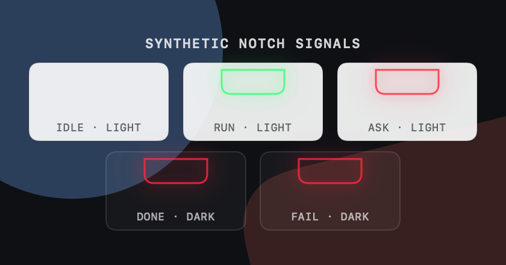
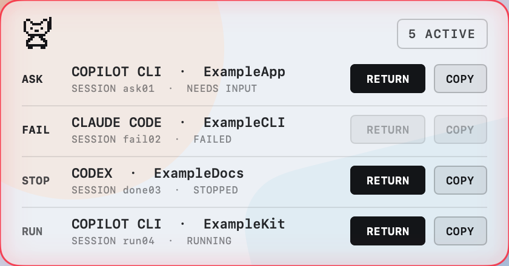
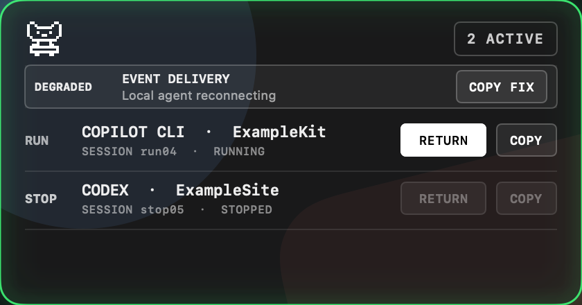

# Mews Product Design

## One-line Positioning

Mews is a local macOS companion for people who run AI coding agents in terminals. It watches explicit agent lifecycle events and lets you know when a task finishes, fails, or needs attention.

> Mews keeps an eye on your terminal AI agents, so you do not have to.

## Current Product Direction

Mews should stay small, local, and terminal-friendly. The first useful version should make one promise: if an AI agent stops needing the terminal in front of you, Mews makes that state visible.

The product should not become an AI dashboard or a second chat surface. It should be a quiet menu bar utility with a clear CLI, safe setup, and reliable undo.

## Target Users

### Core Users

Developers who run AI coding agents in macOS terminals:

- Claude Code users
- Codex CLI users
- Copilot CLI users
- People who keep multiple terminal panes open while agents edit code, run tests, or wait for permission

### Secondary Users

macOS power users who like local utilities and want a low-noise, scriptable status notifier instead of a full dashboard.

## User Problems

1. AI agents often finish while the user is looking somewhere else.
2. Failed, blocked, or permission-waiting states are easy to miss outside the terminal.
3. Multiple agents can run at once, making it hard to know which project needs attention.
4. System notifications disappear quickly, so there needs to be a small local history.
5. Generic menu bar or notch tools are not designed around AI agent lifecycle events.

## What Mews Does

The first stage turns explicit terminal-agent events into local, low-noise status.

Scope:

- Receive local events from CLI commands, hooks, wrappers, or scripts.
- Show the latest state in the macOS menu bar.
- Open a compact physical-notch or top-center shell with current sessions, native scrolling, and validated per-session actions.
- Keep a short recent-event history.
- Support system notifications.
- Provide integrations for Claude Code, Codex, and Copilot CLI when stable hooks are available.
- Provide `mw run -- <command>` as a wrapper fallback for tools without lifecycle hooks.
- Avoid transcript, code, prompt, and terminal scrollback capture by default.

## What Mews Does Not Do

- It is not an AI chat client.
- It does not replace Claude Code, Codex, or Copilot CLI.
- It does not read full code, full conversations, or terminal scrollback by default.
- It does not sync to cloud services.
- It is not a team monitoring product.
- It is not a general log analysis platform.
- It does not promise automatic detection of every terminal state in the first version.

## MVP Scope

The MVP only needs to prove that users stop missing important AI agent states.

Must have:

1. `mw setup --yes`
2. `mw notify --source copilot --status done --project Mews --message "Task finished"`
3. Claude Code, Codex, and Copilot CLI lifecycle integration.
4. Local event history.
5. `mw doctor` that reports setup, hook, store, and companion state honestly.
6. `mw undo` for Mews-owned integrations.
7. Clear privacy copy in the README.
8. A thin menu bar companion with a fixed-size notch/top-center shell for all displayable current sessions, native vertical scrolling, and validated per-session actions, launched by `mw start`.
9. Versioned, checksummed packages, a Homebrew Cask, and a credential-gated signed release path.

Runtime health is separate from agent lifecycle presentation. `mw status`, `mw doctor`, and the native companion use one local snapshot: `checking` applies when a transition is pending and no confirmed degraded or blocked capability outranks it, `ready` hides repair controls, `degraded` preserves core event delivery while naming the affected capability, and `blocked` means a core local dependency is unavailable. The native UI shows only fresh confirmed degradation or blockage, with a copyable recovery instruction when available. Configuration drift and functional IPC failure remain distinct.

Can wait:

1. Graphical setup.
2. Long-term event history.
3. Automatic terminal-state detection.
4. Quiet mode and richer notification rules.

## State Model

Mews first handles five states:

| State | Meaning | UI expression |
|---|---|---|
| `running` | Agent is working | Steady green physical-notch or expanded-shell edge glow and running menu-bar pose |
| `needs_input` | Main agent is waiting for user input, permission, or confirmation | Red breathing physical-notch or expanded-shell edge glow until resolved, or a system notification without a physical notch |
| `done` | Main task finished | Two-second red breathing edge glow, preserved across expansion, then green while another session runs or steady red when all sessions stop |
| `failed` | Main task failed or a command exited unexpectedly | Two-second red breathing edge glow, preserved across expansion, then the same aggregate running/stopped state as completion |
| `idle` | No active task | No collapsed physical-notch surface |

UI freshness is separate from stored history. `running` and `needs_input` can drive the collapsed notch signal for 24 hours, while `done` and `failed` can drive it for 30 minutes. Session presence is tracked separately: explicit Claude Code, Codex, or Copilot CLI lifecycle evidence is treated as open until `SessionEnd`, with a 24-hour safety cap, while legacy or hookless sources remain unknown and use status freshness. A stopped unknown-presence session therefore expires after 30 minutes. Closed and expired sessions stay available in bounded local history. Timestamps more than five minutes ahead of the local clock are not treated as current.

Events stay deliberately small:

```json
{
  "source": "copilot",
  "session_id": "abc123",
  "project": "Mews",
  "status": "done",
  "message": "Task finished",
  "timestamp": "2026-07-07T18:40:00+08:00"
}
```

## Interaction Principles

1. Quiet by default. Only primary-agent completion, non-recoverable failure, and user-needed states should interrupt.
2. The menu bar should be reliable. Extra visuals are optional enhancements.
3. The pixel logo should open a compact shell without turning Mews into a dashboard. Keep the 420×220 frame, show all displayable current sessions through native scrolling, keep recent events out of the active panel, and expose only validated per-session actions.
4. Integrations must be explicit. Mews should not secretly read terminal output.
5. Missed notifications and silent subagent events should be recoverable from recent local history.
6. Stale unknown-presence states return to `idle` on the fixed freshness schedule, and known-open states use the 24-hour safety cap so missed closure events cannot stay visible forever.
7. Returning to work should take one action: open a confirmed Codex App thread directly, switch an available tmux client back to the original pane, or open kitty and attach when the validated same-user tmux socket and pane still exist without a client. If no exact target is available, use the configured terminal and a validated directory. Keep a local Mews history command available without executing event-provided command text.
8. Each attention event uses one automatic channel: the physical-notch glow when available, otherwise Notification Center.
9. While expanded, retained session order and health actions stay fixed so refreshes cannot move an action target beneath the pointer; sessions that close disappear immediately.

### Hide stopped sessions

- Active Session rows stay unchanged by default. Only an ordered `STOP` row accepts a mouse left-drag or a two-finger trackpad swipe to the left.
- Movement remains attached to the pointer or fingers after an 8-point slop and a 1.25 horizontal direction lock. Native vertical scrolling wins when that lock is not met, and only one row can be dragged or revealed at a time.
- A deliberate short swipe that passes input slop but does not cross 20% settles at approximately 10% of the row width, with a 56-point minimum so a complete 44×24 `HIDE` button and six-point side insets fit. Smaller movements close the row.
- The revealed background is only slightly darker than the original row and follows the shell's native macOS material and accessibility fallbacks. The separate `#c80f28` HIDE button grows from a circle into the same compact shape and typography as `COPY`, without clipping its label. Its right edge stays fixed while further dragging lengthens it leftward; its centered text initially moves only slightly.
- Crossing 20% springs the red button across the full track, with six-point side insets, unchanged 24-point height, and the accepted vertical alignment. Only the HIDE text snaps to the button's left inner edge, without scaling or a separate alignment animation. The button elongates rather than moving across the row as a fixed-width slider. Hiding still occurs only after release, and a 16-point retreat hysteresis cancels the full-swipe state.
- Both the revealed button and full swipe submit the same evidence-scoped local write. The row leaves only after persistence succeeds. A write failure returns it to the revealed position for retry, while an ordering-unknown row remains visible and unavailable.
- Hiding removes only the matching evidence from Active Sessions. Local event history, notifications, and the upstream CLI session remain unchanged. Strictly newer primary evidence restores the session automatically.
- Reduce Motion keeps direct tracking and static settling/full-swipe feedback, and replaces spatial removal with a 100 ms ease-out fade. VoiceOver exposes `Hide from Active Sessions` as a row custom action, while the visual `HIDE` layer stays out of the accessibility tree.

## Display and Accessibility Behavior

- Prefer a physical notch when one is available. In clamshell or external-display layouts, use the main display's top center below its menu bar.
- Use live display topology for alert routing. A physical-notch alert suppresses the matching system notification; fallback layouts notify without auto-opening the top-center panel.
- Keep collapsed status inside a four-point contour around the visible left, right, and bottom notch edges. Do not add a persistent strip below the hardware.
- Carry the active glow color and breathing or stop-pulse timing onto the expanded shell edge without restarting the effect.
- Recalculate placement after display hot-plug, resolution, coordinate, or main-screen changes. Hide cleanly if macOS temporarily reports no screens.
- Keep the panel available across Spaces and full-screen windows without activating the app.
- Keep only the expanded physical-notch shell solid black. Use a detached, appearance-aware material surface for top-center placement.
- Reduce Motion removes repeating pixel animation and spatial shell transitions without changing layout.
- Reduce Transparency and Increase Contrast replace top-center material with an opaque high-contrast surface.
- Increase Contrast strengthens secondary copy, separators, borders, status labels, and disabled controls.
- VoiceOver should identify the status item and expanded panel, then read native summaries and action labels in visual order.
- Session rows should expose agent, bounded project, shortened session reference, status, and Return availability without reading full local identifiers or paths.
- Idle uses a static pixel frame. The app reuses a responsive external agent, checks that ownership through its existing two-second local refresh, and never terminates an agent it did not launch. Failed child restarts back off from 10 seconds to a five-minute cap and reset after one healthy minute.
- Public interface previews use fixed synthetic projects, short session identifiers, safe messages, and no local history, prompt, path, username, or terminal content.

## Interface Previews

These synthetic previews use fixed, privacy-safe data.

Collapsed physical-notch glows in light and dark appearance:



The light top-center panel inherits the red needs-input edge glow while showing multiple active sessions and enabled or disabled return actions:



The dark top-center panel inherits the green running edge glow while showing a degraded health message and session actions:



## Install and Distribution

The release package path is:

```bash
tar -xzf mews-vX.Y.Z-darwin.tar.gz
cd mews-vX.Y.Z-darwin
sudo ./install.sh
mw setup --yes
mw start
mw doctor
mw notify --status done --message "Hello"
```

Local development uses:

```bash
make build
./bin/mw setup --yes
./bin/mw start
./bin/mw doctor
```

## README Opening Copy

```text
Mews

Never miss your terminal AI agents.

A local macOS menu bar companion for AI coding agents running in terminals.
```

## Success Signals

1. Users keep Mews running during real AI coding sessions.
2. Users can tell which project or session needs attention without reopening every terminal.
3. Copilot lifecycle notifications work without scraping terminal content.
4. Setup and undo feel safe enough for users to try without fear.
5. Users ask for more integrations after the first one proves useful.

## Product Risks

### Risk 1: Agent hooks are inconsistent across tools

Use official lifecycle hooks where available. Keep `mw run -- <command>` as a fallback for tools without hooks.

### Risk 2: Visual polish distracts from the core loop

Keep the first version focused on event capture, local history, notifications, and honest diagnostics.

### Risk 3: Users worry about privacy

Accept explicit events only. Do not read transcripts, code, prompts, or terminal scrollback by default. Make task-title capture opt-in and local-only.

### Risk 4: State detection becomes unreliable

Avoid guessing from terminal output. Prefer hooks, wrappers, and explicit user events.

## Recommended Direction

Keep Mews focused on one job: turning AI agent lifecycle events into reliable local Mac status.

The product boundary matters more than feature count. Mews should stay quiet, reversible, and trustworthy.
